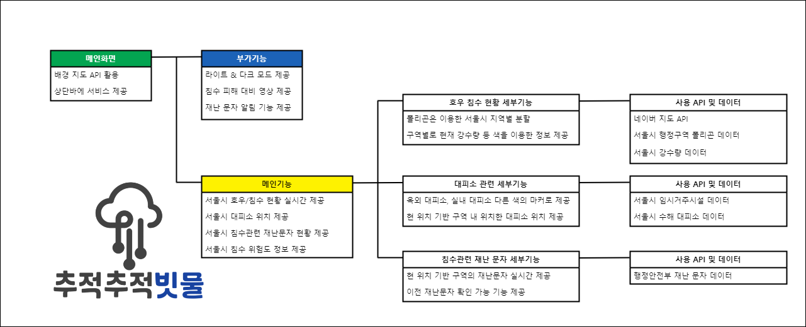

# 재난문자를 활용한 재난 대비 지도 사이트

## 개요
서울시에서 제공하는 API를 활용하여 재난문자를 관리하고, 재난 시 사용 할 수 있는 지도 사이트를 제작하였습니다.

## 개발환경
| 하드웨어 환경 | 소프트웨어 환경 |
| --- | --- |
| CPU : Ryzen 7 7800X3D   GPU : NVIDIA GeForce 4060TI 8GB  8Gbps(Memory Speed), Compute Capability 6.1   Memory : 16GB, 2133MHz  저장장치 : HDD | Platform : Github pages    Heroku   Tailwind |

## IA

 

##  기능
- 침수 피해 정보 제공
- 재난 문자 정보
- 대피소 정보
- 대피요령 영상
- 광고

##  설명
네이버 지도 API를 활용, 행정구역을 폴리곤으로 구분합니다. 각 지역의 실시간 강수량을 각 지역에 색칠된 색을 통하여 구별할 수 있습니다. 재난 행동 요령 영상을 통하여 재난 시 대응 방법을 제공합니다. 재난문자 데이터를 활용하여 현재 위치한 지역의 재난 문자를 받아볼 수 있습니다. 수신된 재난문자는 최신 순으로 50개 까지만 조회할 수 있습니다. 서울시 임시거주시설 데이터와 서울시 수해 대피소 데이터를 활용하여 위치 마커로 위치를 알려줍니다.

## 스크린샷 및 상세 설명

메인화면입니다.

